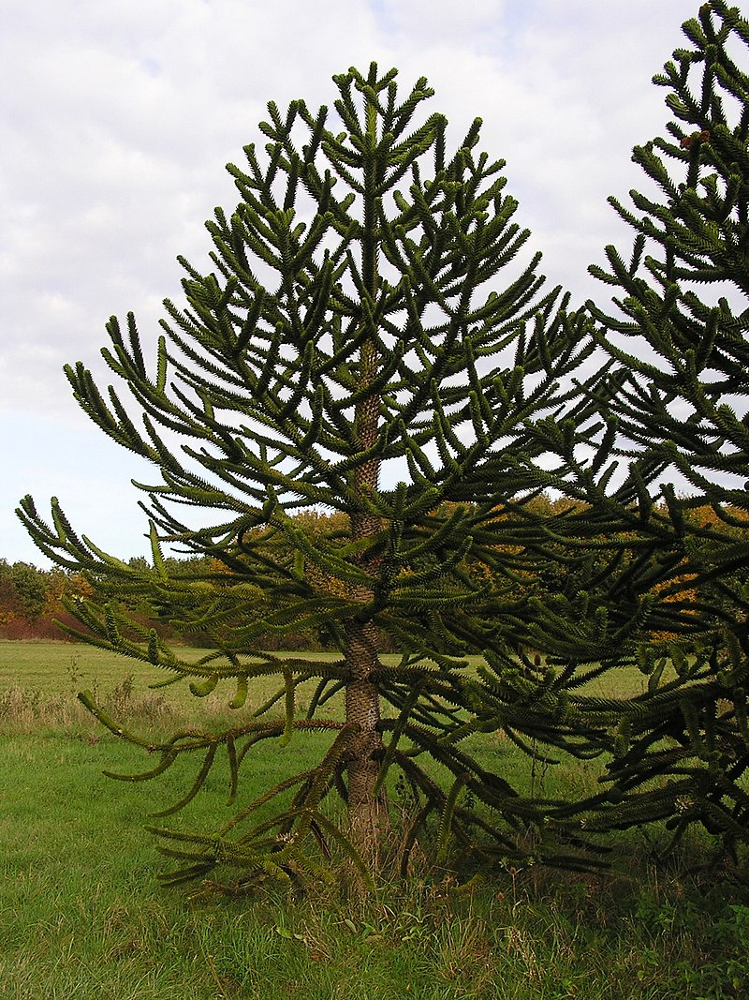

# Kian-Baghernejad 🌟

Welcome to the personal website of Kian Baghernejad — a curious Kid who lives in Germany 🇩🇪. Kian speaks German and Persian, enjoys working with Linux 🐧 and Raspberry Pi 🍓, and loves making fun projects using ScratchJr 🐱. He’s a passionate reader 📚 of everything from Italo Calvino stories to Vater und Sohn comics.

He also loves swimming 🏊‍♂️ and dreams of working with amazing German car companies 🚗 someday. This website is a space to share his favorite things, learning journey, and maybe even his future ideas as an engineer in training! 🛠️🚀

---

  
  
<em>Schlangenbaum 🌳 — a fictional group Kian is proud to be a part of, inspired by the book by Uwe Timm.</em>

---
